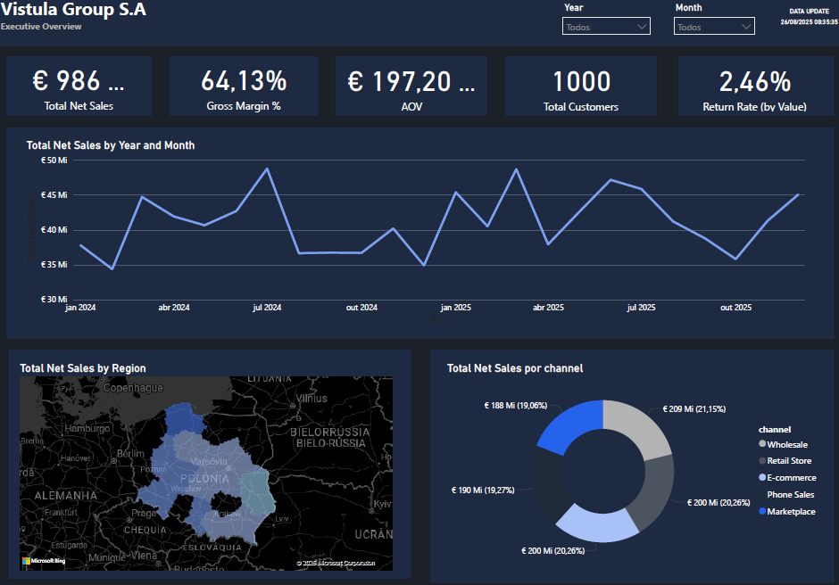
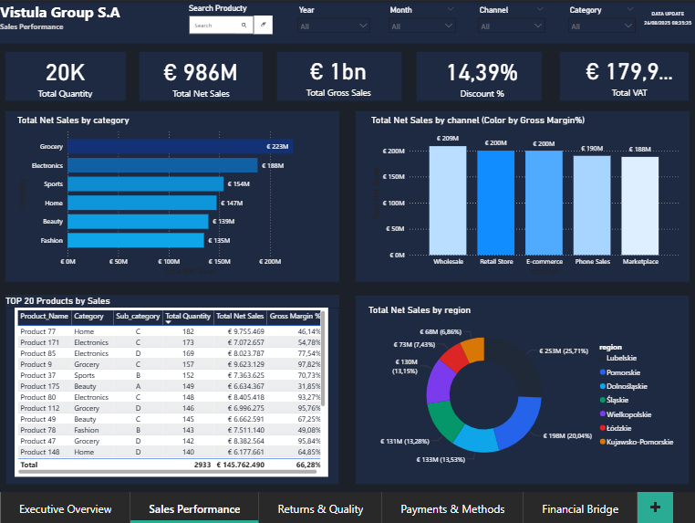

# Vistula Retail – Business Intelligence Dashboard (Demo)

📊 **Overview**  
This project simulates a fictitious Polish retail company called **Vistula Retail S.A.**, using synthetic sales, returns, and payments data.  
The goal is to demonstrate skills in **Power BI, SQL, and DAX modeling** applied to a corporate reporting scenario.

---

## 🚀 Features
- **Executive Overview**: Strategic KPIs (Net Sales, Gross Sales, VAT, Discounts, Quantities).  
- **Sales Performance**: Category, channel, and product analysis with margin %.  
- **Returns & Quality**: Return Rate (Qty & Value), channel and regional impact.  

---

## 🛠️ Tech Stack
- **Power BI** (DAX, Power Query, tabular modeling)  
- **SQL** for fact and dimension table simulation  
- **Excel/CSV** for generating demo datasets  

---

## 📂 Data Structure
- **Fact tables**: `fact_sales`, `fact_returns`, `fact_payments`  
- **Dimension tables**: `dim_date`, `dim_customer`, `dim_product`, `dim_channel`, `dim_store`, `dim_geo`, `dim_payment_method`  

---

## 🔗 Model relationships (keys)
- `fact_sales[date_key]` → `dim_date[date_key]`  
- `fact_sales[customer_id]` → `dim_customer[customer_id]`  
- `fact_sales[product_id]` → `dim_product[product_id]`  
- `fact_returns[sale_id]` → `fact_sales[sale_id]` *(return linkage)*  
- `fact_payments[sale_id]` → `fact_sales[sale_id]`  

---

## 📸 Preview
  
  

---

## 🎯 Key Learnings
- Built **return analysis metrics** with Return Rate % by channel/region.  
- Applied **multi-fact modeling** (Sales, Returns, Payments).  
- Designed a **dark corporate layout** with clear KPIs and storytelling.  

---

## 📥 File
- [Download Dashboard PDF](./Vistula_Retail_Demo.pdf)

---

## 👨‍💻 Author
**Leonardo Cabral** – Data Analyst | Power BI | SQL | SAP | Power Platform  
Certification in progress: **Microsoft PL-300**

